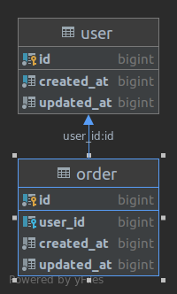

# Migration with symfony doctrine and postgres

##First steps
###1. Create database 
```
name: migration
username: migration
password: migration
```
###2. Install composer
- Command
```shell
composer install
```
- Output
```shell
Loading composer repositories with package information
Installing dependencies (including require-dev) from lock file
Package operations: 28 installs, 0 updates, 0 removals
  - Installing ocramius/package-versions (1.5.1): Loading from cache
  - Installing psr/container (1.0.0): Loading from cache
  - Installing symfony/service-contracts (v2.1.3): Loading from cache
  - Installing symfony/stopwatch (v5.1.2): Loading from cache
  - Installing symfony/polyfill-php80 (v1.18.0): Loading from cache
  - Installing symfony/polyfill-mbstring (v1.18.0): Loading from cache
  - Installing symfony/polyfill-intl-normalizer (v1.18.0): Loading from cache
  - Installing symfony/polyfill-intl-grapheme (v1.18.0): Loading from cache
  - Installing symfony/polyfill-ctype (v1.18.0): Loading from cache
  - Installing symfony/string (v5.1.2): Loading from cache
  - Installing symfony/polyfill-php73 (v1.18.0): Loading from cache
  - Installing symfony/console (v5.1.2): Loading from cache
  - Installing zendframework/zend-eventmanager (3.2.1): Loading from cache
  - Installing zendframework/zend-code (3.4.1): Loading from cache
  - Installing ocramius/proxy-manager (2.2.3): Loading from cache
  - Installing doctrine/event-manager (1.1.0): Loading from cache
  - Installing doctrine/cache (1.10.2): Loading from cache
  - Installing doctrine/dbal (2.10.2): Loading from cache
  - Installing doctrine/migrations (2.2.1): Loading from cache
  - Installing doctrine/lexer (1.2.1): Loading from cache
  - Installing doctrine/annotations (1.10.3): Loading from cache
  - Installing doctrine/reflection (1.2.1): Loading from cache
  - Installing doctrine/collections (1.6.6): Loading from cache
  - Installing doctrine/persistence (2.0.0): Loading from cache
  - Installing doctrine/instantiator (1.3.1): Loading from cache
  - Installing doctrine/inflector (1.4.3): Loading from cache
  - Installing doctrine/common (3.0.2): Loading from cache
  - Installing doctrine/orm (v2.7.3): Loading from cache
symfony/service-contracts suggests installing symfony/service-implementation
symfony/polyfill-intl-normalizer suggests installing ext-intl (For best performance)
symfony/polyfill-intl-grapheme suggests installing ext-intl (For best performance)
symfony/console suggests installing psr/log (For using the console logger)
symfony/console suggests installing symfony/event-dispatcher
symfony/console suggests installing symfony/lock
symfony/console suggests installing symfony/process
zendframework/zend-eventmanager suggests installing container-interop/container-interop (^1.1.0, to use the lazy listeners feature)
zendframework/zend-eventmanager suggests installing zendframework/zend-stdlib (^2.7.3 || ^3.0, to use the FilterChain feature)
zendframework/zend-code suggests installing zendframework/zend-stdlib (Zend\Stdlib component)
ocramius/proxy-manager suggests installing ocramius/generated-hydrator (To have very fast object to array to object conversion for ghost objects)
ocramius/proxy-manager suggests installing zendframework/zend-json (To have the JsonRpc adapter (Remote Object feature))
ocramius/proxy-manager suggests installing zendframework/zend-soap (To have the Soap adapter (Remote Object feature))
ocramius/proxy-manager suggests installing zendframework/zend-xmlrpc (To have the XmlRpc adapter (Remote Object feature))
doctrine/cache suggests installing alcaeus/mongo-php-adapter (Required to use legacy MongoDB driver)
doctrine/migrations suggests installing jdorn/sql-formatter (Allows to generate formatted SQL with the diff command.)
doctrine/migrations suggests installing symfony/yaml (Allows the use of yaml for migration configuration files.)
doctrine/orm suggests installing symfony/yaml (If you want to use YAML Metadata Mapping Driver)
Package zendframework/zend-eventmanager is abandoned, you should avoid using it. Use laminas/laminas-eventmanager instead.
Package zendframework/zend-code is abandoned, you should avoid using it. Use laminas/laminas-code instead.
Generating autoload files
ocramius/package-versions: Generating version class...
ocramius/package-versions: ...done generating version class
19 packages you are using are looking for funding.
Use the `composer fund` command to find out more!
```

##Usage:
### 1. Dump sql

- Command
```shell
php ./vendor/bin/doctrine orm:schema-tool:update --dump-sql
```
- Output
```sql
 The following SQL statements will be executed:

     CREATE TABLE "user" (id BIGSERIAL NOT NULL, created_at BIGINT NOT NULL, updated_at BIGINT NOT NULL, PRIMARY KEY(id));
     CREATE INDEX IDX_8D93D6498B8E8428 ON "user" (created_at);
     CREATE TABLE "order" (id BIGSERIAL NOT NULL, user_id BIGINT DEFAULT NULL, created_at BIGINT NOT NULL, updated_at BIGINT NOT NULL, PRIMARY KEY(id));
     CREATE INDEX IDX_F5299398A76ED395 ON "order" (user_id);
     ALTER TABLE "order" ADD CONSTRAINT FK_F5299398A76ED395 FOREIGN KEY (user_id) REFERENCES "user" (id) NOT DEFERRABLE INITIALLY IMMEDIATE;
```

### 2. Update database

- Command
```shell
php ./vendor/bin/doctrine orm:schema-tool:update --force
```
- Output
```shell
Updating database schema...

     5 queries were executed

                                                                                                                        
 [OK] Database schema updated successfully!
```

### 3. Create migration version file

- Command
```shell
php ./vendor/bin/doctrine-migrations migrations:diff
```
- Output
```shell
Generated new migration class to "/meete/database/php-symfony-doctrine-migration/src/Migration/Version20210428072213.php"

To run just this migration for testing purposes, you can use migrations:execute --up 20210428072213

To revert the migration you can use migrations:execute --down 20210428072213
```
##Result
####Migration Database

